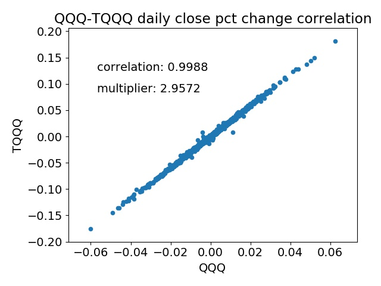
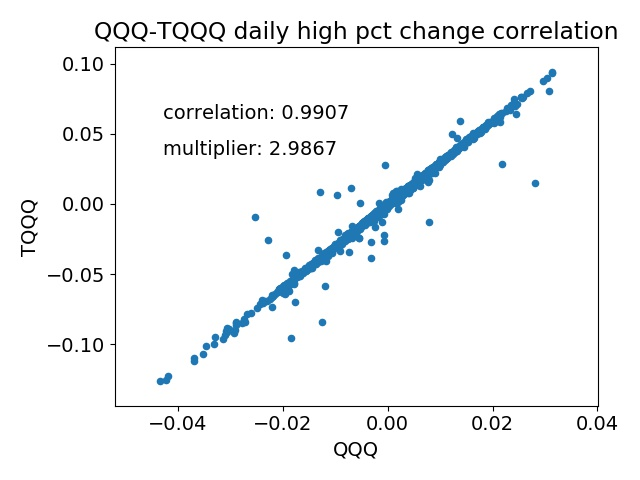

# simulate_triple_leverage
The first leveraged ETF was introduced in 2006, and since then, several leveraged ETFs have appeared on the scene.  My interest was in seeing how the triply leveraged ETFs TQQQ and SQQQ from the QQQ ETF (the NASDAQ 100) would fare during a recession, since these appeared around 2009 and have only existed in a bull market.  I also wanted to do some backtesting on TQQQ and SQQQ to see how some simple momentum strategies would work.  The problem is that there is no data for TQQQ and SQQQ before 2009, making backtesting through a recession impossible.

The solution: use the underlying ETF (e.g. QQQ) to simulate the leveraged ETFs from the days before they existed.  QQQ was [created in](https://www.invesco.com/portal/site/us/investors/etfs/product-detail?productId=qqq) 1999, so we should be able to simulate an extra 10 years of TQQQ and SQQQ data from that.  For SPY, UPRO (3x), and SPXU (-3x), we can simulate data all the way back to 1993 from the inception of UPRO and SPXU (2009).

At a high level, the code here simulates leveraged ETFs by first finding the correlation between the normal ETF and leveraged ETF daily close-close and open-open, high-high, and low-low percent changes.  For QQQ and TQQQ/SQQQ, the correlation is extremely high (~99%), which makes simulating the daily close-close percent change easy.  We just get the multiplier (around 3 for TQQQ/QQQ) and multiply the underlying ETF's daily percent change by the multiplier.  Then the daily prices are back-calculated from the latest leveraged ETF datapoint.  Currently, it uses machine learning to get the open, high, and low prices from ratios of open/close, etc.  I had mistakenly thought the open-open, h-h, and l-l percent changes between the underlying ETF and the leveraged ones were not correlated, but it looks like they are.  However, the QQQ-SQQQ (3x inverse leverage) relationship for open and high percent changes dont' seem to hold well.





An interesting finding along the way is that the daily close-close multiplier is a little lower than the other multipliers.  For open, high, and low, the multiplier is very close to 3, but for TQQQ and QQQ the close-close percent change is around 2.96.  Perhaps this is related to the 0.95% [expense ratio](https://www.proshares.com/funds/tqqq.html), although I'd expect that to be a yearly fee, not daily.

# Usage and requirements
Currently, this assumes usage of data from [Quandl's EOD dataset](https://www.quandl.com/data/EOD-End-of-Day-US-Stock-Prices).  Using data from Yahoo finance is in progress.  Sample data is available in the 'eod_data' folder (QQQ, TQQQ, and SQQQ csvs).


# Preparation
This uses an Anaconda virtual environment and zipline to create the data.  The idea is to create custom data for backtesting with zipline.

## Install Zipline dependencies
https://www.zipline.io/install.html

For Ubuntu 18 LTS:
`sudo apt-get install libatlas-base-dev python-dev gfortran pkg-config libfreetype6-dev`

## Create environment
To create the environment, first make sure you have Anaconda installed and updated (`conda update conda` once Anaconda is installed), and execute the command:

`conda env create -f conda_zipline_env.yml` (currently untested)

This will create an Anaconda virtual environment with the name 'zipline'.  Activate the environment before running any code in the repo with:

`conda activate zipline`

As of creation of this repo, zipline requires Python 3.5, which uses an out-of-date pandas version.  

## Customizing and updating the environment
To export the zipline environment, execute:
`conda zipline export > conda_zipline_env.yml`

### Create zipline conda env from scratch
`conda create --name zipline`
`conda activate zipline`
(also need to first have talib built on system)
`pip install zipline matplotlib feather-format quandl pandas-market-calendars jupyter ipython TA-lib`

For now, you have to implement a fix in the benchmarks code: https://github.com/quantopian/zipline/issues/2480#issuecomment-531525573

# Creating simulated data

Run `create_simulated_triple_leverage.py` to create the simulated data.  By default, it creates simulated TQQQ and SQQQ datasets from QQQ.

## Load simulated data into zipline bundle
To use zipline with backtests, this needs to be run after creating the simulated data.  You will have to change the CSVDIR variable to your filepath where you saved the data.

`CSVDIR=/home/nate/Dropbox/data/eod_data/simulated/ zipline ingest -b csvdir`

or

`CSVDIR=/home/nate/Dropbox/data/eod_data/simulated/ python -m zipline ingest -b csvdir`

if zipline is not in your PATH environment variable.


## Show symbols in bundle
This will show the available symbols in a bundle.  Useful if you forgot what all you have in your custom CSV bundle.

```python
# get list of symbols in bundle
# https://github.com/quantopian/zipline/issues/1579#issuecomment-377393187

import os
from pandas import Timestamp
from zipline.data.bundles import load

now = Timestamp.utcnow()
bundle = load('csvdir', os.environ, now)
symbols = set(str(asset.symbol)
              for asset in bundle.asset_finder.retrieve_all(
                           bundle.asset_finder.equities_sids))
d = bundle.asset_finder.retrieve_all(bundle.asset_finder.sids)
print(d)

```

## Backtest example
- Todo

Other todo:
- compare percent differences between actual and predicted values using ML vs simply multiplying by ratio from ETF/lev_ETF
